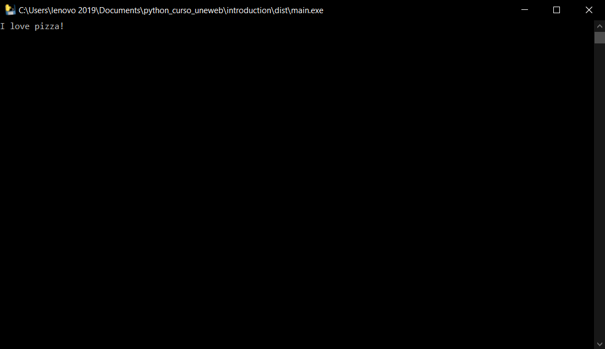

# Introduction to understand how compile Python

> This repository was created to understand how a `python` file can be compiled to generate an `.exe` file.


## Built With

- Python
- pip
- pyinstaller

## Live Demo

[Live Demo Link](https://www.online-python.com/McSo6sF4dR)

## Getting Started

This project was created with the purpose of studying the compilation of `python` files for their subsequent transformation into executable files with the `.exe` extension.

### Prerequisites

- Windows, Linux or Mac (operating system)
- Python
- pip
- pyinstaller

### Install

Download the code or copy the git repository to your computer and follow the next steps:

1. Install `python` in your computer. You can download it from [here](https://www.python.org/downloads/).

2. Depending on your operating system and the version of `python` you have installed, you may need to install `pip`. You can download it from [here](https://pip.pypa.io/en/stable/installing/).

3. After installing Python and pip, you should check if they are installed in your console or terminal, by executing the following command in your console or terminal:

  ```bash
  python --version
  ```

  ```bash
  pip --version
  ```

4. If you have installed `python` and `pip` correctly, you should see the version of each one in your console or terminal.

5. Once the `Python` and `pip` installations have been verified, we proceed to install the python compiler `pyinstaller` using the command:

  ```bash
  pip install pyinstaller
  ```

6. Once the installation is complete, you can verify that the installation was successful by executing the following command in your console or terminal:

  ```bash
  pyinstaller --version
  ```

7. If you have installed `pyinstaller` correctly, you should see the version of it in your console or terminal.

8. Then to compile the code we must execute the command:

  ```bash
  pyinstaller --onefile main.py
  ```

### Usage

Run the main.py file.

### Run tests

Linters errors

## Author

👤 **Author**
Aristides Jose Molina Pérez

- GitHub: [@aristides1000](https://github.com/aristides1000)
- Twitter: [@aristides_1000](https://twitter.com/@aristides_1000)
- LinkedIn: [aristides jose molina perez](https://www.linkedin.com/in/aristides-molina/)

## 🤝 Contributing

Contributions, issues, and feature requests are welcome!

Feel free to check the [issues page](https://github.com/aristides1000/python_introduction/issues).

## Show your support

Give a ⭐️ if you like this project!

## Acknowledgments

Uneweb: For letting us start this journey
Google: For letting us find crucial information in order to create this project
